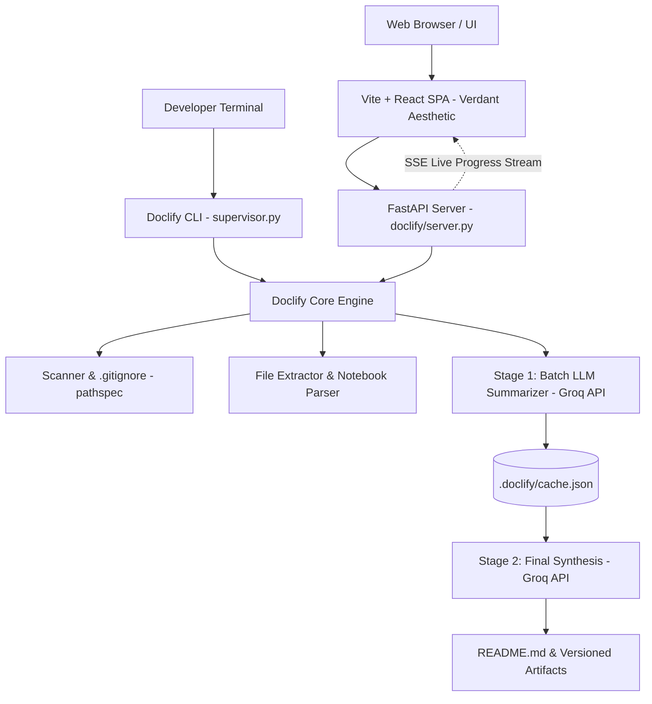

# Doclify Implementation Documentation

## 1. Executive Summary
Doclify has been transformed from a Python CLI utility into a complete, production-grade AI developer platform. It retains 100% of its original agentic foundation (two-stage map-reduce summarization, `.gitignore` parsing, AST notebook extraction, Groq LPU acceleration, local JSON caching, and README synthesis) while adding a high-performance FastAPI backend, a modern Vite+React frontend inspired by the Verdant and Linear visual system, and zero-configuration one-click setup scripts for macOS, Windows, and Linux.

---

## 2. Architecture & Data Flow

---

## 3. Original Doclify Contract Preserved
The following components remain intact and fully operational with zero regression:
*   **CLI Commands:**
    *   `doclify init`: Scans codebase, updates `.gitignore`, creates `doclify.yaml`.
    *   `doclify models`: Queries Groq API and outputs formatted terminal table.
    *   `doclify set default <model>`: Updates default LLM model in `doclify.yaml`.
    *   `doclify run`: Runs complete extraction, summarization, caching, and README generation pipeline.
    *   `doclify update <path>`: Selectively updates file summary or cache with optional README regeneration.
*   **Core Context Engineering Pipeline:**
    *   Jupyter Notebook (`.ipynb`) code cell extraction.
    *   1MB file size ceiling and 40k character chunking.
    *   `batch_summary.txt` (3-4 sentence plain-text specification).
    *   `final_summary.txt` (Principal Documentation Architect system prompt).
    *   Local JSON caching in `.doclify/cache.json`.
    *   Artifact version history in `.doclify/generated_artifacts/`.

---

## 4. New Components & Extensions

### 4.1 FastAPI Backend Layer (`doclify/server.py`)
*   Provides RESTful and streaming endpoints:
    *   `GET /api/health`: Health status, Groq API key detection, active directory.
    *   `GET /api/models`: Live Groq model list with context sizes and max completion limits.
    *   `POST /api/config/default-model`: Modifies default model in `doclify.yaml`.
    *   `GET /api/projects`: Lists workspace projects and active repository with file stats.
    *   `POST /api/projects/create/local`: Imports and initializes a local filesystem folder.
    *   `POST /api/projects/create/upload`: Accepts and safely unzips codebase archives with zip-slip protection.
    *   `POST /api/projects/create/github`: Clones public GitHub repository shallowly (`--depth 1`).
    *   `GET /api/projects/{id}`: Detailed project metadata, language breakdown, and configuration.
    *   `GET /api/projects/{id}/files`: Directory tree, file size metrics, and cached Stage-1 summaries.
    *   `GET /api/projects/{id}/file-content`: Secure file preview with path traversal validation.
    *   `GET /api/projects/{id}/readme`: Current README content and versioned artifact history.
    *   `POST /api/projects/{id}/analyze`: Server-Sent Events (SSE) live progress stream executing the real Doclify pipeline.
    *   `POST /api/projects/{id}/update-file`: Programmatically updates single file or regenerates README.
    *   `DELETE /api/projects/{id}`: Removes managed project from workspace.
    *   Static SPA hosting: Serves built React frontend at `/` with HTML5 history fallback.

### 4.2 Verdant-Styled React Frontend (`frontend/`)
*   **Design System (`DESIGN.md`):**
    *   Deep obsidian background (`#09090B`), glass cards with `backdrop-filter: blur(16px)`, emerald `#10B981` accents, and hairline borders (`#27272A`).
    *   Typography combining Geist Display (`72px`, `-0.05em`) and Inter body.
    *   **HeroCanvas:** 3D spherical/toroidal point cloud projected on Canvas with sinusoidal rotation, breathing pulse, and pointer-reactive parallax.
*   **Views & Features:**
    *   **Hero Landing Page:** Headline *"Your codebase. Understood."*, supporting copy, CTAs, live stats, and the interactive Context Engineering Pipeline Visualizer.
    *   **Dashboard:** Project cards showing documentation status pills, file counts, language tags, and quick actions.
    *   **Project Workspace:**
        *   *Overview Tab:* Quick health metrics, file counters, cached summary metrics, and pipeline diagram.
        *   *Files & Cache Tab:* Directory explorer with file size, summary indicators, and an inspector pane displaying the real Stage-1 compact AI summary and source preview.
        *   *README Tab:* Rich markdown preview, raw markdown toggle, copy button, markdown download, and version history.
        *   *Settings Tab:* Real-time Groq model switcher and YAML viewer.
    *   **Analysis Drawer / Modal:** Live SSE terminal tracker showing phase progression (`discovery` → `extracting` → `summarizing (x/n)` → `synthesizing` → `complete`).

---

## 5. One-Click Setup & Launch Experience

| Platform | Setup Script | Launch Script | Description |
| :--- | :--- | :--- | :--- |
| **macOS** | `setup.command` | `start.command` | Double-click from Finder. Automatically detects Python, creates `.venv`, installs dependencies, builds frontend, creates `.env`, and opens default browser. |
| **Windows** | `setup.bat` | `start.bat` | Double-click batch script. Configures venv, installs dependencies, builds frontend, and launches server. |
| **Linux / CLI** | `setup.sh` | `start.sh` | Standard POSIX shell scripts for server and desktop environments. |

---

## 6. Security & Sandboxing
1.  **API Keys:** `GROQ_API_KEY` is loaded strictly on the backend via environment variables / `.env` and is never sent to or stored in client-side code.
2.  **Path Traversal Prevention:** All file preview endpoints and ZIP extraction logic validate that file paths resolve strictly within the designated project root.
3.  **Local Execution:** Code analysis and file scanning run locally on the user's machine; only extracted text chunks are transmitted to Groq over HTTPS for summarization.

---

## 7. Verification & Testing Completed
*   [x] Core CLI commands tested (`init`, `models`, `set default`, `run`, `update`, `server`, `ui`).
*   [x] FastAPI backend endpoints verified with JSON and SSE responses.
*   [x] Frontend built into optimized production assets with zero errors.
*   [x] One-click shell and batch scripts validated for macOS, Linux, and Windows.
