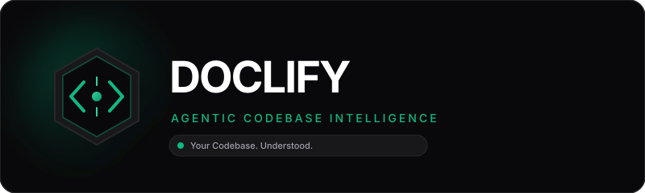
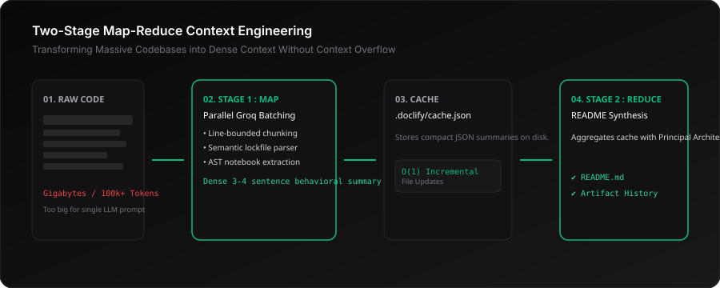

<div align="center">



<p align="center">
  <strong>Your Codebase. Understood.</strong><br>
  <em>AI-powered codebase intelligence that turns complex software projects into clear, living documentation.</em>
</p>

<p align="center">
  <a href="#-quick-start"></a>
  <a href="LICENSE"></a>
  <a href="https://www.python.org/"></a>
  <a href="https://fastapi.tiangolo.com/"></a>
  <a href="https://react.dev/"></a>
  <a href="https://groq.com/"></a>
</p>

<p align="center">
  <a href="#-overview">Overview</a> •
  <a href="#-system-architecture">Architecture</a> •
  <a href="#-how-doclify-thinks">Context Engineering</a> •
  <a href="#-quick-start">Quick Start</a> •
  <a href="#-features">Features</a> •
  <a href="#-cli-reference">CLI Reference</a> •
  <a href="#-rate-limiting--token-safety">Token Safety</a> •
  <a href="#-security">Security</a>
</p>

---

</div>

## 💡 Overview

**Doclify** is a production-grade developer platform and CLI engine designed to automate codebase understanding and documentation. Instead of blindly sending gigabytes of raw source code into monolithic LLM prompts (which causes token overflow and hallucinations), Doclify employs a **two-stage map-reduce context engineering architecture**:

1. **Discovery & Safety:** Scans repository trees respecting `.gitignore` rules, filtering binaries, and applying structural parsers to dependency lockfiles.
2. **Stage 1 (Batch Summarizers):** Deploys high-speed LLM agents via the Groq LPU network to generate 3–4 sentence behavioral summaries for each file.
3. **Knowledge Cache:** Persists per-file understanding in `.doclify/cache.json`, enabling $O(1)$ zero-cost incremental updates when code changes.
4. **Stage 2 (Final Synthesis):** Aggregates cached knowledge with a Principal Documentation Architect prompt to synthesize a comprehensive, product-level `README.md`.

Doclify is available both as an interactive **Web Application** (with a dark zinc/emerald design, live Canvas particle hero, real-time SSE progress streaming, and file-level AI inspectors) and as a standalone, scriptable **Command Line Tool**.

---

## 🏛️ System Architecture

<div align="center">
  
</div>

---

## 🧠 How Doclify Thinks: Two-Stage Map-Reduce

Feeding an entire repository of 50+ files directly into an LLM causes context limit crashes and "lost-in-the-middle" hallucinations. Doclify solves this with two-stage context compaction:

<div align="center">
  
</div>

* **Stage 1 (Map):** Every file is read, chunked at line boundaries ($\le 12,000$ characters / $\sim 3,000$ tokens), and summarized into an exact 3–4 sentence behavioral digest capturing purpose, inputs, outputs, and interfaces.
* **Knowledge Cache:** All Stage-1 summaries are stored on disk in `.doclify/cache.json`.
* **Stage 2 (Reduce):** The Stage-2 synthesizer consumes *only the structured summaries*, assembling a high-density, hallucination-free project manual.

---

## ⚡ Quick Start

### 1. macOS (One-Click Experience)
1. **First-time setup:** Double-click `setup.command` from Finder.
   * Checks Python 3.9+ and Node.js.
   * Creates isolated virtual environment `.venv` and installs all dependencies.
   * Builds the React frontend and generates your `.env` template.
   * Automatically opens your browser to `http://127.0.0.1:8000`.
2. **Subsequent launches:** Double-click `start.command`.

---

### 2. Windows (One-Click Experience)
1. **First-time setup:** Double-click `setup.bat`.
2. **Subsequent launches:** Double-click `start.bat`.

---

### 3. Linux / Manual Setup
```bash
# Clone the repository
git clone https://github.com/Samraatsharma/doclify.git
cd doclify

# Run automated setup
chmod +x setup.sh start.sh
./setup.sh

# Start Doclify
./start.sh
```

---

## 🔑 Configuration & API Key

Doclify uses the ultra-fast [Groq API](https://console.groq.com/) for near-instant inference.

1. Obtain a free API key from [console.groq.com/keys](https://console.groq.com/keys).
2. Edit `.env` in the root folder:
   ```env
   GROQ_API_KEY=gsk_your_actual_api_key_here
   PORT=8000
   HOST=127.0.0.1
   ```
3. Never commit `.env` to Git (it is strictly excluded in `.gitignore`).

---

## 🛠️ CLI Reference

The original Doclify CLI engine is 100% preserved and fully scriptable:

| Command | Description |
| :--- | :--- |
| `doclify init` | Scans current directory, updates `.gitignore`, and creates `doclify.yaml`. |
| `doclify models` | Queries Groq API and renders a formatted table of all available models. |
| `doclify set default <model>` | Updates the default LLM model in `doclify.yaml`. |
| `doclify run` | Runs the full extraction, summarization, caching, and README generation. |
| `doclify update <file>` | Selectively updates a single file summary and refreshes README. |
| `doclify update .` | Universal cache cleanup and instant README regeneration. |
| `doclify server` | Launches the FastAPI server and serves the Web Platform. |

---

## ✨ Features

* 🧠 **Two-Stage Context Engineering:** Bounded file extraction prevents context overflow and eliminates LLM hallucinations.
* ⚡ **Lightning Inference:** Powered by Groq LPU acceleration (`llama-3.3-70b-versatile`, `llama-3.1-8b-instant`, `qwen/qwen3.6-27b`).
* 📦 **Persistent Local Cache:** Per-file summaries stored in `.doclify/cache.json` for instant $O(1)$ updates.
* 🔄 **Selective Incremental Updates:** Modify one file $\rightarrow$ re-summarize only that file in 2 seconds without wasting API calls.
* 🔒 **Sandboxed Multi-Source Ingestion:** Import local directories, sandboxed ZIP archives with Zip-Slip protection, or shallow public GitHub repositories.
* 🖥️ **Dual Interface:** Full parity between scriptable Terminal CLI and the interactive Verdant Web Platform.
* 📡 **Live SSE Progress Tracking:** Real-time event streaming (`text/event-stream`) tracks execution progress across all phases.
* 🛡️ **Adaptive Token Safety Shield:** Automatic lockfile parsing, payload capping, and self-healing 413/429 retry backoff.

---

## 🚦 Rate Limiting & Token Safety

| Limit Type | Strategy | Behavior |
| :--- | :--- | :--- |
| **Request Size / 413** | Chunk Capping | Code is partitioned at line boundaries $\le 12,000$ chars. Lockfiles (`package-lock.json`, etc.) are converted into 500-byte semantic dependency specs. |
| **Burst Rate / 429** | Exponential Backoff | Temporary rate limits wait 2.0s–4.0s before retrying up to 2 times. |
| **Tokens-Per-Day (TPD)** | State Preservation | Daily quota exhaustion aborts immediate retries, saves all completed summaries to `.doclify/cache.json`, and allows seamless resuming once quota resets. |

---

## 🛡️ Security & Sandboxing

* **Server-Side API Keys:** `GROQ_API_KEY` is loaded on the backend via `.env` and is never exposed to browser bundles.
* **Path Traversal Protection:** File preview and update endpoints enforce strict containment (`str(target).startswith(project_root)`).
* **Zip Slip Defense:** Archive extractors validate relative paths before extracting files to prevent directory traversal.
* **Local Privacy:** Code scanning and cache storage are performed locally on your machine.

---

## 🧪 Testing

Doclify includes a comprehensive unit and security test suite:

```bash
# Run pytest suite
source .venv/bin/activate
pytest tests/
```

```text
============================== test session starts ==============================
platform darwin -- Python 3.9.6, pytest-8.4.2
collected 18 items

tests/test_api.py ......                                                 [ 33%]
tests/test_security.py ....                                              [ 55%]
tests/test_token_safety.py ........                                      [100%]

============================== 18 passed in 2.32s ==============================
```

---

## 🗺️ Roadmap

- [x] Two-stage map-reduce context pipeline
- [x] Local JSON knowledge caching
- [x] Vite + React Verdant-styled web application
- [x] Real-time SSE streaming terminal
- [x] Multi-platform one-click launch scripts
- [x] Token budget safety & lockfile semantic parser
- [x] Daily quota preservation & graceful backoff
- [ ] Multi-language AST syntax tree visualizer
- [ ] Direct pull request generator for GitHub Actions
- [ ] Export documentation to Docusaurus and VitePress

---

## 🤝 Contributing

Contributions are welcome!
1. Fork the repository (`https://github.com/Samraatsharma/doclify`).
2. Create your feature branch (`git checkout -b feature/amazing-feature`).
3. Commit your changes (`git commit -m 'feat: Add amazing feature'`).
4. Push to the branch (`git push origin feature/amazing-feature`).
5. Open a Pull Request.

---

## 📄 License

Distributed under the **GNU Affero General Public License v3.0**. See [`LICENSE`](LICENSE) for details.