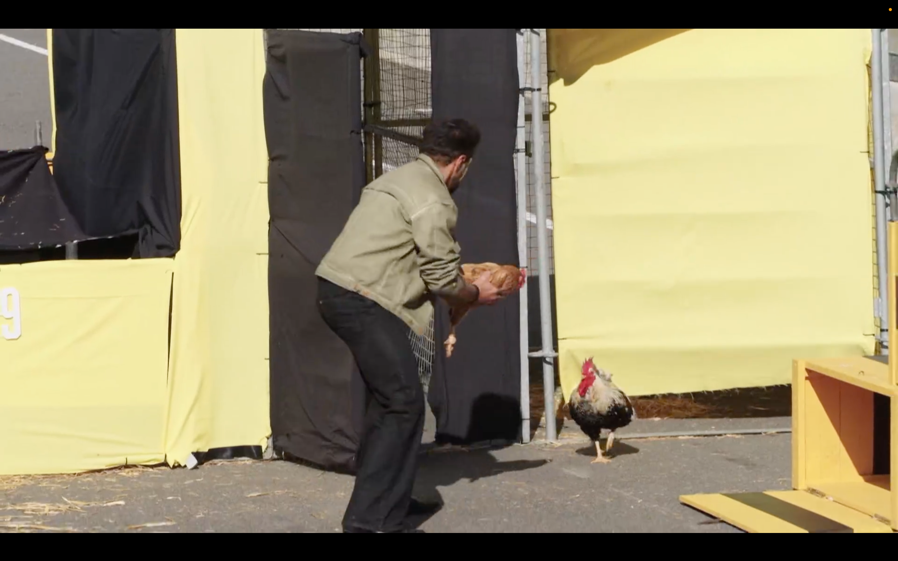
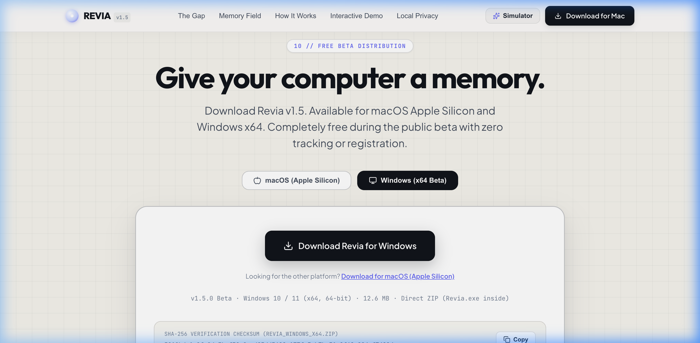
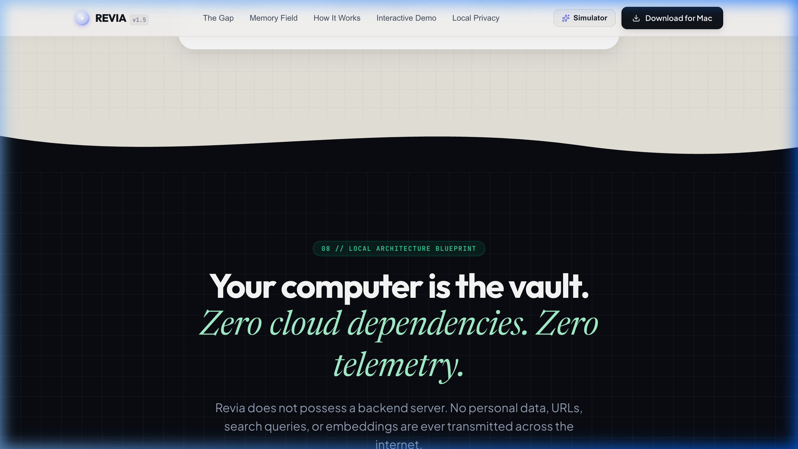

<div align="center">

  

  # REVIA

  **"Your computer remembers, so you don't have to."**

  *An ambient, privacy-first on-device personal memory search engine for macOS & Windows.*

  [-000000?style=for-the-badge&logo=apple&logoColor=white)](https://revia-3v8.pages.dev/downloads/Revia_1.5.0_aarch64.zip)
  [-0078D4?style=for-the-badge&logo=windows&logoColor=white)](https://revia-3v8.pages.dev/downloads/Revia_Windows_x64.zip)
  [](https://www.rust-lang.org/)
  [](https://tauri.app/)
  [](#-100-local-privacy-architecture)
  [](LICENSE)

  <br />

  <a href="https://revia-3v8.pages.dev/downloads/Revia_1.5.0_aarch64.zip">
    
  </a>
  &nbsp;&nbsp;
  <a href="https://revia-3v8.pages.dev/downloads/Revia_Windows_x64.zip">
    
  </a>
  &nbsp;&nbsp;
  <a href="https://revia-3v8.pages.dev">
    
  </a>

</div>

---

## 💡 What is Revia?

**Revia** is a lightweight, ambient desktop assistant that gives your computer a permanent personal memory. It silently indexes your browsing activity, documents, and notes into an encrypted, local SQLite FTS5 database paired with ONNX vector embeddings.

When you need to find that article, paper, or web snippet you read three days ago—even when you can't remember its title or where you saw it—simply double-tap `Control` (`⌃ ⌃`) on macOS or press `Alt + Space` on Windows to summon Revia instantly.

<br />

<div align="center">
  
  <p><em>The translucent Revia search capsule summoned over the desktop space with instant FTS5 + Semantic results.</em></p>
</div>

---

## ✨ Why Revia?

- ⚡ **Zero-Friction Summoning**: Accessible in <100ms via native double-Control (`⌃ ⌃`) tap or `Alt + Space`.
- 🧠 **Hybrid BM25 + Vector Search**: Merges exact keyword matching (SQLite FTS5) with conceptual semantic search (`FastEmbed` / ONNX `all-MiniLM-L6-v2`).
- 🔒 **100% On-Device & Private**: Zero cloud network calls, zero tracking scripts, zero remote LLM API dependencies. Your data never leaves your RAM and local disk.
- 🎨 **Minimal Ambient Design**: Translucent glassmorphism silhouette floating seamlessly above active workspace windows with automated focus-loss dismissal.
- ⚡ **Lightweight Footprint**: Built with Rust and Tauri v2 for minimal CPU & RAM consumption (<50 MB RAM idle).

---

## 🛠️ How It Works

```
┌─────────────────────────────────────────────────────────────────┐
│                      BACKGROUND INGESTION                       │
│  Monitors Chrome History & Local Memory (Every 5 Minutes)      │
└─────────────────────────────────────────────────────────────────┘
                                │
                                ▼
┌─────────────────────────────────────────────────────────────────┐
│                 ENCRYPTED LOCAL STORAGE (SQLITE)                │
│  - SQLite 3 FTS5 BM25 Full-Text Search Table                    │
│  - FastEmbed Dense Vector Embedding Store (384-dimensional)     │
└─────────────────────────────────────────────────────────────────┘
                                │
                                ▼
┌─────────────────────────────────────────────────────────────────┐
│                      INSTANT ASSISTANT UX                       │
│  - Press ⌃ ⌃ (Mac) or Alt+Space (Windows)                       │
│  - Type query or use voice dictation                            │
│  - Hybrid reranking algorithm delivers instant results          │
│  - Press Enter to launch URL or Escape to dismiss               │
└─────────────────────────────────────────────────────────────────┘
```

---

## 🖥️ Visual Showcase

### 1. First-Run Setup & Onboarding
Revia detects virgin state on launch and displays a centered, step-by-step onboarding carousel guiding users through permission grants, history ingestion, and global shortcuts.

<div align="center">
  
</div>

<br />

### 2. Dual-Platform Public Distribution Portal
Our production website auto-detects visitor OS and provides instant direct access to verified release ZIPs for both Apple Silicon and Windows x64.

<div align="center">
  
</div>

<br />

### 3. On-Device Local Privacy Architecture
Revia's architecture relies exclusively on local system hooks and on-device SQLite databases.

<div align="center">
  
</div>

---

## 💻 Platform Matrix & Capabilities

| Capability | macOS (v1.5.0 Beta) | Windows (v1.5.0 Beta) | Technical Detail |
| :--- | :--- | :--- | :--- |
| **Target Architecture** | Apple Silicon (`arm64`) | Windows 10/11 (`x86_64`) | Native compiled binaries |
| **Global Shortcut** | `⌃ ⌃` (Double Control) | `Alt + Space` | Mac uses `CGEventTap`; Windows uses `tauri-plugin-global-shortcut` |
| **Search Engine** | SQLite FTS5 BM25 | SQLite FTS5 BM25 | Native embedded SQLite 3 engine |
| **Vector Engine** | FastEmbed ONNX | FastEmbed ONNX | 384-dim `all-MiniLM-L6-v2` dense embeddings |
| **Voice Dictation** | Native `Speech.framework` | Stubbed (In Dev) | Mac uses Objective-C `AVFoundation` + `SFSpeechRecognizer` |
| **History Ingestion** | Chrome SQLite History | Chrome SQLite History | Auto-converts Chrome time microsecond epoch to Unix ms |
| **System Tray** | Menu Bar Icon | System Tray Icon | Native context menu ("Open", "Pause", "Settings", "Quit") |
| **Auto-Hide on Blur** | Active | Active | Hides capsule after 800ms activation grace period |
| **Package Format** | Direct `.zip` (`Revia.app`) | Direct `.zip` (`Revia.exe`) | Validated with `unzip -t` and SHA-256 checksums |
| **Verification Status** | **VERIFIED PASS** | **PACKAGED / RUNTIME UNVERIFIED** | *Windows cross-compiled on macOS darwin-arm64 host* |

---

## 🔬 Search & Ranking Pipeline

Revia combines keyword matching and semantic vector scoring into a single unified relevance score:

$$\text{FinalScore} = 0.6 \times \text{Norm}(\text{BM25Score}) + 0.4 \times \text{CosineSimilarity}(\mathbf{v}_{\text{query}}, \mathbf{v}_{\text{document}})$$

1. **FTS5 BM25**: Evaluates query term frequencies, inverse document frequency, and snippet proximity inside SQLite.
2. **FastEmbed Vector Embeddings**: Generates 384-dimensional dense vectors using the ONNX-optimized `all-MiniLM-L6-v2` model running locally.
3. **Stale Request Protection**: Search worker threads employ atomic query sequence tokens to discard out-of-order async responses.

---

## 🔒 100% Local Privacy Architecture

- **Zero Remote Cloud Requests**: Query inputs, indexed pages, and embeddings are never uploaded to any remote cloud API or server.
- **Local Application Data**: SQLite databases reside strictly inside standard OS user directories:
  - macOS: `~/Library/Application Support/com.revia.app/revia_memory.db`
  - Windows: `%APPDATA%\com.revia.app\revia_memory.db`
- **Zero Telemetry**: No analytics engines, tracking pixels, or third-party error monitoring beacons.

---

## 🧰 Technology Stack

- **Backend**: Rust 1.98.0
- **App Framework**: Tauri v2 (`2.11.x`)
- **Frontend**: React 18, TypeScript 5, Vite 8
- **Database**: SQLite 3 (`rusqlite`) with FTS5 BM25 extension
- **Embeddings**: `fastembed` 6.0 (ONNX Runtime)
- **macOS Native Layer**: Objective-C (`mac_native.m`), `AVFoundation`, `Speech.framework`, `CoreGraphics`
- **Windows Cross-Compiler**: `cargo-xwin`, LLVM/Clang 23, `lld-link`, Microsoft MSVC CRT/SDK
- **Hosting**: Cloudflare Pages (`revia-3v8.pages.dev`)

---

## 📦 Official Release Binaries & Verification

All official release artifacts are hosted directly on our global edge network and verified with SHA-256 checksums.

| Release Package | Target | Size | SHA-256 Checksum | Download Link |
| :--- | :--- | :--- | :--- | :--- |
| **`Revia_1.5.0_aarch64.zip`** | macOS (`arm64`) | 14.1 MB | `5d193b00d72632c9627f1226d16429fe1378b18958483c34cc437d1e39a87914` | [**Download Mac ZIP**](https://revia-3v8.pages.dev/downloads/Revia_1.5.0_aarch64.zip) |
| **`Revia_Windows_x64.zip`** | Windows (`x64`) | 12.6 MB | `5819bda1a2fc9da3bef50a9ccd83dd5628a177fa5eb7be51e9f68e994af7490d` | [**Download Windows ZIP**](https://revia-3v8.pages.dev/downloads/Revia_Windows_x64.zip) |

---

## 🚀 Installation & Security Guidance

### macOS First Launch (Gatekeeper Note)
Because Revia is an open beta distributed outside the Mac App Store, macOS Gatekeeper may present an "unidentified developer" prompt on first launch:
1. Open **System Settings → Privacy & Security**.
2. Scroll to the message regarding Revia and click **Open Anyway**.
3. (Alternatively: Right-click **Revia.app** in Finder, select **Open**, and click **Open**).

### Windows First Launch (SmartScreen Note)
As an unsigned open beta release, Windows Defender SmartScreen may display an informational notice:
1. Click **More info**.
2. Click **Run anyway**.

*Note: Revia respects all operating system security controls and never requests security bypasses or system modifications.*

---

## 🧪 Beta Testing & Bug Reporting

We actively encourage feedback from our public beta testers!
- Please refer to our [**Beta Testing Guide**](REVIA_BETA_TESTING_GUIDE.md) for detailed test scenarios.
- Review our [**Master Technical Specification**](REVIA_MASTER_TECHNICAL_DOCUMENT.md) for architecture deep-dives.
- Review the [**v1.5.0 Release Notes**](REVIA_V1.5.0_BETA_RELEASE_NOTES.md) for detailed changelogs.

---

## ⚠️ Known Limitations

1. **Windows Native Voice**: Speech dictation on Windows is currently stubbed (text search and global shortcuts are fully functional).
2. **Windows Physical Testing**: Cross-compilation was executed on macOS ARM64 host; physical Windows runtime testing is ongoing.
3. **Apple Notarization**: App bundle is ad-hoc signed; requires standard first-time Gatekeeper approval.

---

## 📄 License

Revia is open-source software licensed under the [MIT License](LICENSE).