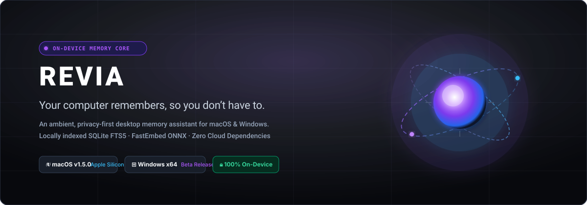
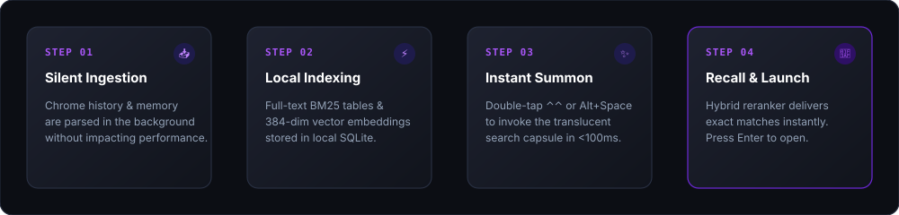
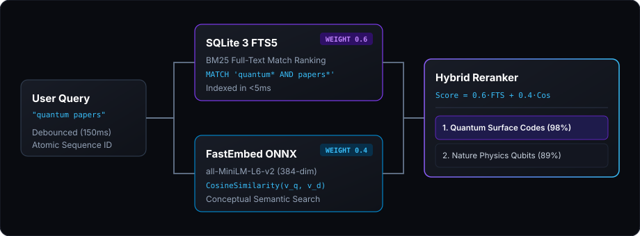
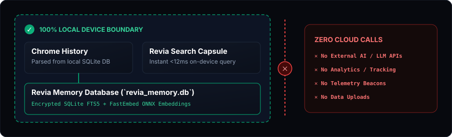

  

    

  
  &nbsp;&nbsp;
  
  &nbsp;&nbsp;
  

    

  [-000000?style=flat-square&logo=apple&logoColor=white)](https://revia-3v8.pages.dev/downloads/Revia_1.5.0_aarch64.zip)
  [-0078D4?style=flat-square&logo=windows&logoColor=white)](https://revia-3v8.pages.dev/downloads/Revia_Windows_x64.zip)
  
  
  
  

---

## 🧭 The Problem

> *"I know I saw that paper three days ago... was it on arXiv, GitHub, or a browser tab?"*

Every day, knowledge workers, researchers, and engineers read hundreds of articles, documentation pages, code repositories, and research notes. 

Traditional bookmarks require tedious manual effort, and standard browser history search requires remembering the exact URL or title. When you only remember a **concept**, the information is effectively lost in the noise.

---

## 💡 The Revia Idea

**Your computer becomes searchable memory.**

Revia is an ambient, on-device cognitive memory assistant. It silently indexes your browsing history and desktop interactions into an encrypted local **SQLite 3 FTS5** index paired with dense vector embeddings generated via **FastEmbed / ONNX**.

Whenever you need recall, simply summon Revia to search everything you've seen using exact keywords, fuzzy terms, or natural concepts.

---

## ⚡ How It Works

  

1. **Remember**: You read a paper, article, or documentation page in your browser.
2. **Summon Revia**: Double-tap `Control` (`⌃ ⌃`) on macOS or press `Alt + Space` on Windows.
3. **Speak or Type**: Enter a query or describe the concept in natural language.
4. **Instant Recall**: Revia's hybrid reranker retrieves and ranks the exact page in milliseconds.
5. **Open**: Press `Enter` to open the URL directly in your browser.

---

## 🎬 The Interactive Experience

  
  
<em>Live interaction model: Instant global summon, active Memory Core, and real-time FTS5 + Semantic results.</em>

- **Floating Ambient Capsule**: Borderless glassmorphic interface with top-center anchoring.
- **Dynamic Expansion**: Automatically expands from 52px idle search bar to 470px with ranked result cards as you type.
- **Focus-Loss Dismissal**: Automatically hides when you switch tasks, keeping your workspace distraction-free.

---

## 🎙️ Voice Interaction

- **macOS Native Speech Engine**: Direct integration with Apple `AVFoundation` and `Speech.framework` (`SFSpeechRecognizer`) in native Objective-C (`mac_native.m`).
- **Real-Time Dictation**: Streaming audio buffer converts speech into instant text queries without external cloud API calls.
- **Windows Voice**: Graceful stubbed fallback; native Windows Media capture engine scheduled for upcoming release.

---

## 🔬 Search & Ranking Engine

  

Revia executes a hybrid ranking formula that balances exact lexical keyword matches with deep conceptual semantic similarity:

$$\text{FinalScore} = 0.6 \times \text{Norm}(\text{BM25Score}) + 0.4 \times \text{CosineSimilarity}(\mathbf{v}_{\text{query}}, \mathbf{v}_{\text{document}})$$

- **SQLite 3 FTS5**: BM25 keyword relevance, prefix matching, and token proximity.
- **FastEmbed ONNX Embeddings**: 384-dimensional dense vectors using the `all-MiniLM-L6-v2` model executed on-device via ONNX Runtime.
- **Stale Request Protection**: Atomic query sequence IDs discard out-of-order async worker responses.

---

## 🔒 Privacy & 100% Local Architecture

  

- **Zero Cloud Network Calls**: Your search queries, browsing history, and embeddings never leave your computer.
- **Local Application Data**: Encrypted SQLite database stored strictly inside standard OS user directories:
  - macOS: `~/Library/Application Support/com.revia.app/revia_memory.db`
  - Windows: `%APPDATA%\com.revia.app\revia_memory.db`
- **Your memories stay on your computer**: No tracking pixels or remote logging beacons. Optional product analytics are separate from your private memories.

---

## 💻 Platform Matrix & Status

| Platform | Target Architecture | Shortcut | Status | Verification Status |
| :--- | :--- | :--- | :--- | :--- |
| **macOS** | Apple Silicon (`arm64` / `aarch64`) | `⌃ ⌃` (Double Control) | **v1.5.0 Beta** | **VERIFIED PASS** (Physically verified on macOS) |
| **Windows** | Windows 10 / 11 (`x86_64`) | `Alt + Space` | **x64 Beta** | **PACKAGED / RUNTIME UNVERIFIED** *(Host is darwin-arm64)* |

---

## 🧰 Technology Stack

- **System Core**: Rust 1.98.0
- **App Framework**: Tauri v2 (`2.11.x`)
- **Frontend**: React 18, TypeScript 5, Vite 8
- **Database**: SQLite 3 (`rusqlite`) with FTS5 BM25 extension
- **Vector Embeddings**: `fastembed` 6.0 (`all-MiniLM-L6-v2` via ONNX Runtime)
- **macOS Bridge**: Objective-C (`mac_native.m`), `AVFoundation`, `Speech.framework`, `CoreGraphics`
- **Windows Cross-Toolchain**: `cargo-xwin`, LLVM/Clang 23, `lld-link`, MSVC CRT/SDK
- **Web Infrastructure**: Cloudflare Pages (`revia-3v8.pages.dev`)

---

## 📦 Official Release Binaries & Verification

All official release artifacts are hosted directly on our global edge network and verified with SHA-256 checksums:

| Release Package | Target Platform | File Size | SHA-256 Checksum | Download Link |
| :--- | :--- | :--- | :--- | :--- |
| **`Revia_1.5.0_aarch64.zip`** | macOS (Apple Silicon) | 14.1 MB | `5d193b00d72632c9627f1226d16429fe1378b18958483c34cc437d1e39a87914` | [**Download Mac ZIP**](https://revia-3v8.pages.dev/downloads/Revia_1.5.0_aarch64.zip) |
| **`Revia_Windows_x64.zip`** | Windows 10/11 (x64) | 12.6 MB | `5819bda1a2fc9da3bef50a9ccd83dd5628a177fa5eb7be51e9f68e994af7490d` | [**Download Windows ZIP**](https://revia-3v8.pages.dev/downloads/Revia_Windows_x64.zip) |

---

## 🚀 Installation & Security Guidance

### macOS First Launch (Gatekeeper Note)
Because this beta release is distributed directly outside the Mac App Store, macOS Gatekeeper may present an "unidentified developer" prompt on first launch:
1. Open **System Settings → Privacy & Security**.
2. Scroll to the message regarding Revia and click **Open Anyway**.
3. (Alternatively: Right-click **Revia.app** in Finder, select **Open**, and click **Open**).

### Windows First Launch (SmartScreen Note)
As an unsigned open beta release, Windows Defender SmartScreen may display an informational notice:
1. Click **More info**.
2. Click **Run anyway**.

*Note: Revia respects all operating system security controls and never requests security bypasses or system modifications.*

---

## 🧪 Beta Testing & Feedback

We welcome tester feedback!
- Read our [**Beta Testing Guide**](REVIA_BETA_TESTING_GUIDE.md) for step-by-step test scenarios and bug reporting templates.
- Read our [**Master Technical Document**](REVIA_MASTER_TECHNICAL_DOCUMENT.md) for comprehensive architectural specifications.
- Read the [**v1.5.0 Release Notes**](REVIA_V1.5.0_BETA_RELEASE_NOTES.md) for version changelogs.

---

## 🗺️ Roadmap

- [x] **v1.5.0**: Cross-platform macOS (Apple Silicon) and Windows (x64) releases.
- [x] **v1.5.0**: Hybrid SQLite FTS5 BM25 + FastEmbed ONNX dense vector search.
- [x] **v1.5.0**: Translucent floating ambient capsule UI with auto-focus dismissal.
- [x] **v1.5.0**: Native double-tap Control (`⌃ ⌃`) listener and Apple Speech dictation.
- [x] **v1.5.0**: Public web portal deployment on Cloudflare Pages.
- [ ] **v1.6.0**: Native Windows Media speech recognition engine integration.
- [ ] **v1.6.0**: Automated background ingestion for Microsoft Edge & Mozilla Firefox.
- [ ] **v1.7.0**: Apple Developer ID Notarization & Windows EV Code Signing.
- [ ] **v1.8.0**: Windows ARM64 (Copilot+ PC) native build.

---

## ⚠️ Known Limitations

1. **Windows Native Voice**: Speech dictation on Windows is currently stubbed (text search and global shortcuts are fully functional).
2. **Windows Physical Testing**: Cross-compilation was executed on a macOS ARM64 host; physical Windows runtime testing is ongoing.
3. **Apple Notarization**: App bundle is ad-hoc signed; requires standard first-time Gatekeeper approval.

---

## 📄 License

Revia is open-source software licensed under the [MIT License](LICENSE).